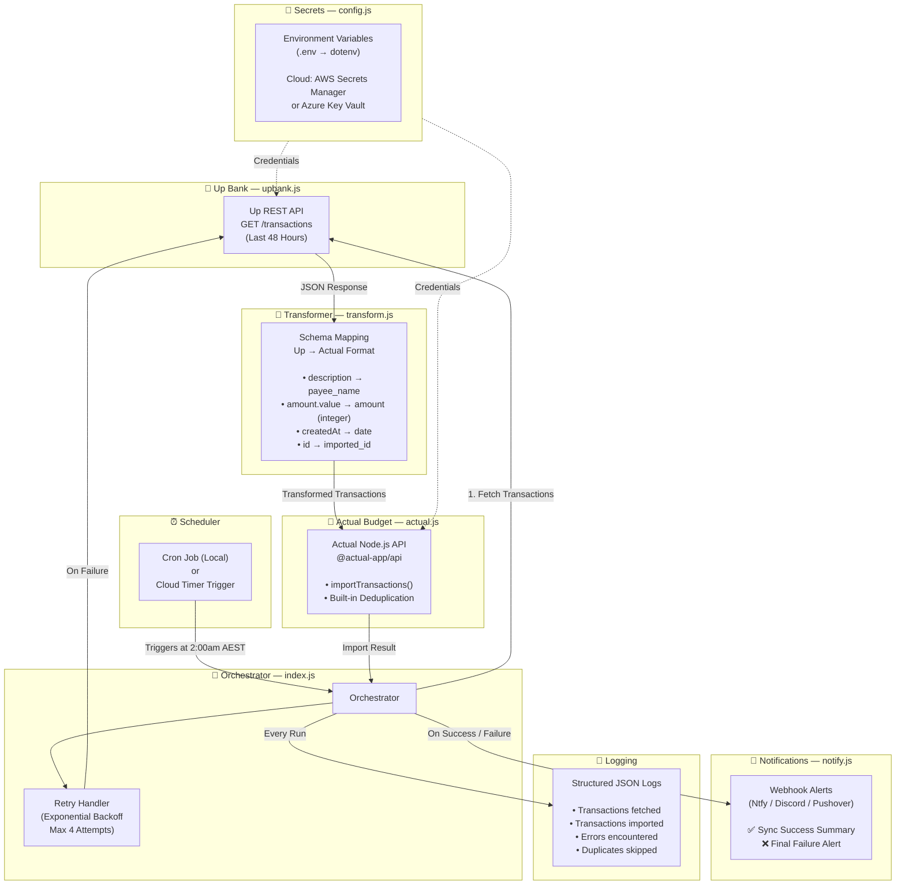
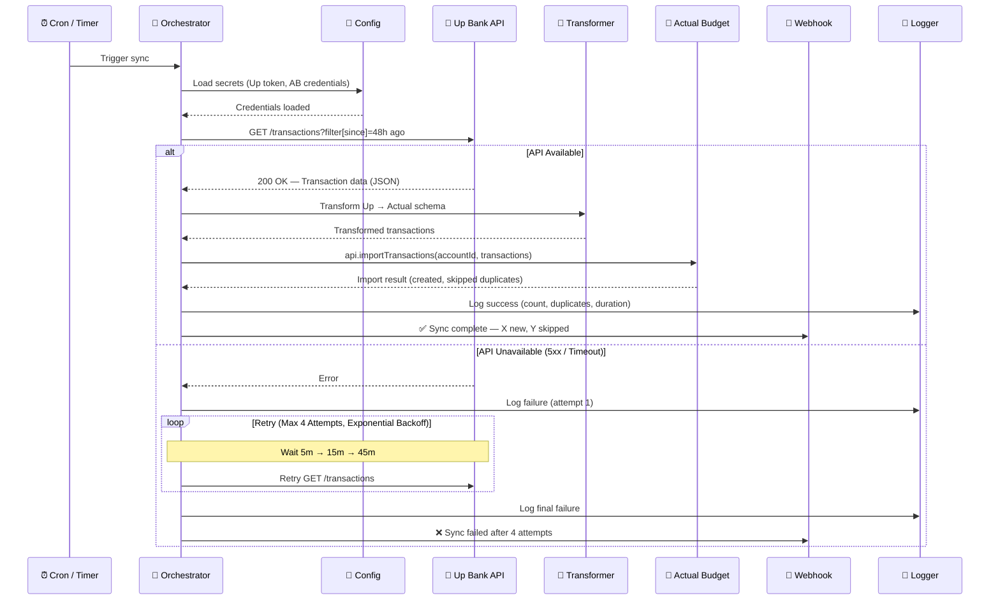
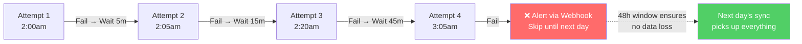

# Up to Actual

An automated transaction sync service that bridges [Up Bank](https://up.com.au/) (Australian neobank) and [Actual Budget](https://actualbudget.org/) (open-source budgeting software). Fetches transactions from Up's REST API and imports them into Actual Budget via its Node.js API on a scheduled basis.

## Why This Exists

Up Bank is an Australian neobank with an excellent [developer API](https://developer.up.com.au/). Actual Budget is an open-source, privacy-first budgeting tool. However, Actual Budget doesn't natively support bank feeds for Australian banks. This service acts as the intermediary layer — fetching transactions from Up and importing them into Actual Budget automatically.

## Architecture

### System Overview



### Sync Flow (Per Execution)



### Retry Strategy



## Transaction Mapping

| Up Bank Field | Actual Budget Field | Notes |
|---|---|---|
| `id` | `imported_id` | Used for deduplication across syncs |
| `attributes.description` | `payee_name` | Matched against AB's payee rules |
| `attributes.amount.value` | `amount` | Converted from float to integer via `amountToInteger()` |
| `attributes.amount.currencyCode` | — | Validated as AUD |
| `attributes.createdAt` | `date` | ISO 8601 → YYYY-MM-DD |
| `attributes.message` | `notes` | Optional; transfer memo or message |
| `attributes.rawText` | — | Available for logging / debugging |

## Project Structure

```
up-to-actual/
├── src/
│   ├── index.js            # Main orchestrator — retry logic, flow control
│   ├── upbank.js           # Up Bank API client — fetch transactions
│   ├── actual.js           # Actual Budget API client — import transactions
│   ├── transform.js        # Schema mapping — Up → Actual format
│   ├── config.js           # Secret loading — env vars / cloud secrets
│   └── notify.js           # Webhook notifications — success/failure alerts
├── logs/                   # Structured JSON log output (gitignored)
├── .env.example            # Template showing required environment variables
├── .gitignore
├── package.json
├── LICENSE
└── README.md
```

## Prerequisites

- **Node.js** >= 18.x
- **An Up Bank account** with a [Personal Access Token](https://api.up.com.au)
- **An Actual Budget instance** (self-hosted or [PikaPods](https://www.pikapods.com/pods?run=actual))
- Your Actual Budget **Sync ID** (Settings → Show advanced settings → Sync ID)

## Environment Variables

Create a `.env` file from the template:

```bash
cp .env.example .env
```

| Variable | Description | Required |
|---|---|---|
| `UP_API_TOKEN` | Up Bank Personal Access Token (Bearer token) | ✅ |
| `ACTUAL_SERVER_URL` | URL of your Actual Budget server | ✅ |
| `ACTUAL_PASSWORD` | Password for your Actual Budget instance | ✅ |
| `ACTUAL_SYNC_ID` | Budget file Sync ID from Actual settings | ✅ |
| `ACTUAL_ACCOUNT_ID` | Account ID in Actual to import transactions into | ✅ |
| `ACTUAL_E2E_PASSWORD` | End-to-end encryption password (if enabled) | ❌ |
| `WEBHOOK_URL` | Notification webhook URL (Ntfy / Discord / Pushover) | ❌ |
| `SYNC_WINDOW_HOURS` | Hours of transaction history to fetch (default: 48) | ❌ |
| `MAX_RETRIES` | Maximum retry attempts on failure (default: 4) | ❌ |
| `LOG_LEVEL` | Logging verbosity: debug, info, warn, error (default: info) | ❌ |

> ⚠️ **Security**: Never commit `.env` files. The `.gitignore` in this repo excludes `.env` and `logs/` by default. When deploying to cloud, use AWS Secrets Manager or Azure Key Vault instead of environment variables.

## Usage

### Manual Run

```bash
node src/index.js
```

### Scheduled (Cron)

```bash
# Edit crontab
crontab -e

# Add entry — runs daily at 2:00am AEST (16:00 UTC)
0 16 * * * cd /path/to/up-to-actual && node src/index.js >> logs/cron.log 2>&1
```

### Cloud Deployment (Future)

This service is designed to be cloud-agnostic. The local Node.js implementation can be deployed to:

- **AWS Lambda** + EventBridge (CloudWatch Events) for scheduled triggers
- **Azure Functions** + Timer Trigger for scheduled triggers

Secrets would be managed via AWS Secrets Manager or Azure Key Vault respectively, with `config.js` abstracting the provider.

## Design Decisions

### Why a 48-Hour Rolling Window?

Rather than tracking a precise "last sync" timestamp, this service fetches the last 48 hours of transactions on every run. This is an enterprise-standard pattern for idempotent data pipelines:

- **Resilience**: If a sync fails entirely, the next day's run picks up everything — no data gaps.
- **Stateless**: No sync timestamp file to corrupt, lose, or get out of sync.
- **Safe**: Actual Budget's `importTransactions()` deduplicates via `imported_id`, so overlapping fetches don't create duplicate entries.

The tradeoff is marginally more API calls, which is negligible for a single spending account.

### Why `importTransactions` over `addTransactions`?

Actual Budget's API offers both methods. `importTransactions` runs the reconciliation engine — matching against existing transactions and deduplicating via `imported_id`. `addTransactions` is for raw data dumps with no deduplication. Since we're syncing incrementally with overlap, deduplication is essential.

### Why Cron + Polling (v1) Instead of Webhooks?

Up Bank supports webhooks natively, which would enable real-time transaction syncing. However, webhooks require a publicly accessible endpoint, which adds complexity (HTTPS, authentication, infrastructure). The cron-based polling approach is simpler to implement, debug, and deploy — especially locally. A webhook-based v2 is a natural evolution once the core logic is proven.

## Future Roadmap

- [ ] **v1.0** — Core sync: Up → Actual via cron (local)
- [ ] **v1.1** — Cloud deployment (AWS Lambda or Azure Functions)
- [ ] **v1.2** — Multi-account support (spending + savings)
- [ ] **v2.0** — Real-time sync via Up Bank webhooks

## Related Projects

- [up-to-ynab](https://github.com/BrodieSutherland/up-to-ynab) — Automatic transaction forwarder from Up to YNAB (Python, Heroku)
- [Actual Budget API Docs](https://actualbudget.org/docs/api/)
- [Up Bank API Docs](https://developer.up.com.au/)
- [Up Bank API Community Projects](https://github.com/up-banking/api/blob/master/community/EXAMPLES.md)

## Contributing

This project was built for personal use, but contributions are welcome. If you're an Australian Up Bank customer using Actual Budget, feel free to open an issue or submit a pull request.

## Licence

[MIT](./LICENSE)
