# Up to Actual

An automated transaction sync service that bridges [Up Bank](https://up.com.au/) (Australian neobank) and [Actual Budget](https://actualbudget.org/) (open-source budgeting software). Fetches transactions from Up's REST API and imports them into Actual Budget via its Node.js API on a scheduled basis.

Deployed as a serverless **Azure Functions** timer trigger — runs daily at 2am Melbourne time for ~$0/month.

## Why This Exists

Up Bank is an Australian neobank with an excellent [developer API](https://developer.up.com.au/). Actual Budget is an open-source, privacy-first budgeting tool. However, Actual Budget doesn't natively support bank feeds for Australian banks. This service acts as the intermediary layer — fetching transactions from Up and importing them into Actual Budget automatically.

## Architecture

### System Overview

```mermaid
flowchart TB
    subgraph Scheduler["⏰ Azure Functions Timer Trigger"]
        TIMER["Timer Trigger\nCron: 0 0 2 * * *\n(2am Melbourne time)"]
    end

    subgraph Core["🔧 Sync Pipeline"]
        direction TB
        SYNC["executeSyncAttempt()\nsrc/sync.js"]
        RETRY["Azure Built-in Retry\n(Exponential Backoff\n5min → 15min → 45min)"]
        SYNC --> RETRY
    end

    subgraph UpBank["🏦 Up Bank — upbank.js"]
        UP_API["Up REST API\nGET /transactions\n(Last 48 Hours)"]
    end

    subgraph Transform["🔄 Transformer — transform.js"]
        MAP["Schema Mapping\nUp → Actual Format\n\n• description → payee_name\n• valueInBaseUnits → amount\n• createdAt → date\n• id → imported_id"]
    end

    subgraph ActualBudget["📒 Actual Budget — actual.js"]
        AB_API["Actual Node.js API\n@actual-app/api\n\n• importTransactions()\n• Built-in Deduplication"]
    end

    subgraph Secrets["🔐 Secrets — config.js"]
        ENV["Azure Application Settings\n(Encrypted at rest)\n\nLocal: .env via dotenv"]
    end

    subgraph Notify["📣 Notifications — notify.js"]
        WEBHOOK["Webhook Alerts\n(Ntfy / Discord / Pushover)\n\n✅ Sync Success Summary\n❌ Final Failure Alert"]
    end

    subgraph Logging["📝 Logging"]
        LOG["Structured JSON Logs\n→ Azure Application Insights\n\n• Transactions fetched\n• Transactions imported\n• Errors encountered\n• Duplicates skipped"]
    end

    TIMER -->|"Triggers at 2:00am AEST"| SYNC
    SYNC -->|"1. Fetch Transactions"| UP_API
    UP_API -->|"JSON Response"| MAP
    MAP -->|"Transformed Transactions"| AB_API
    AB_API -->|"Import Result"| SYNC
    SYNC -->|"On Success / Failure"| WEBHOOK
    SYNC -->|"Every Run"| LOG
    RETRY -->|"On Failure"| UP_API
    Secrets -.->|"Credentials"| UP_API
    Secrets -.->|"Credentials"| AB_API
```



### Sync Flow (Per Execution)

```mermaid
sequenceDiagram
    participant Timer as ⏰ Azure Timer
    participant Sync as 🔧 Sync Pipeline
    participant Config as 🔐 Config
    participant Up as 🏦 Up Bank API
    participant Trans as 🔄 Transformer
    participant AB as 📒 Actual Budget
    participant Notify as 📣 Webhook
    participant Log as 📝 Logger

    Timer->>Sync: Trigger sync
    Sync->>Config: Validate secrets (Up token, AB credentials)
    Config-->>Sync: Credentials validated

    Sync->>Up: GET /transactions?filter[since]=48h ago
    alt API Available
        Up-->>Sync: 200 OK — Transaction data (JSON)
        Sync->>Trans: Transform Up → Actual schema
        Trans-->>Sync: Transformed transactions
        Sync->>AB: api.importTransactions(accountId, transactions)
        AB-->>Sync: Import result (created, skipped duplicates)
        Sync->>Log: Log success (count, duplicates, duration)
        Sync->>Notify: ✅ Sync complete — X new, Y skipped
    else API Unavailable (5xx / Timeout)
        Up-->>Sync: Error
        Sync->>Log: Log failure (attempt 1)
        loop Azure Retry (Max 4 Attempts, Exponential Backoff)
            Note over Sync,Up: Wait 5m → 15m → 45m
            Sync->>Up: Retry GET /transactions
        end
        Sync->>Log: Log final failure
        Sync->>Notify: ❌ Sync failed after 4 attempts
    end
```



### Retry Strategy

```mermaid
flowchart LR
    A["Attempt 1\n2:00am"] -->|"Fail → Wait 5m"| B["Attempt 2\n2:05am"]
    B -->|"Fail → Wait 15m"| C["Attempt 3\n2:20am"]
    C -->|"Fail → Wait 45m"| D["Attempt 4\n3:05am"]
    D -->|"Fail"| E["❌ Alert via Webhook\nSkip until next day"]
    E -.->|"48h window ensures\nno data loss"| F["Next day's sync\npicks up everything"]

    style E fill:#ff6b6b,color:#fff
    style F fill:#51cf66,color:#fff
```



## Transaction Mapping

| Up Bank Field | Actual Budget Field | Notes |
|---|---|---|
| `id` | `imported_id` | Used for deduplication across syncs |
| `attributes.description` | `payee_name` | Matched against AB's payee rules |
| `attributes.amount.valueInBaseUnits` | `amount` | Integer cents — used directly (no float conversion) |
| `attributes.createdAt` | `date` | ISO 8601 → YYYY-MM-DD |
| `attributes.message` | `notes` | Optional; transfer memo or message |
| — | `cleared` | Always `true` (only SETTLED transactions are imported) |

## Project Structure

```
up-to-actual/
├── src/
│   ├── index.js              # CLI entry point — retry logic, process lifecycle
│   ├── sync.js               # Core sync logic — shared between CLI and Azure
│   ├── upbank.js             # Up Bank API client — fetch transactions
│   ├── actual.js             # Actual Budget API client — import transactions
│   ├── transform.js          # Schema mapping — Up → Actual format
│   ├── config.js             # Secret loading — env vars / Azure App Settings
│   ├── backoff.js            # Exponential backoff calculation
│   ├── logger.js             # Structured JSON logging
│   ├── notify.js             # Webhook notifications — success/failure alerts
│   ├── test-up.js            # Test script: verify Up Bank API token
│   ├── test-actual.js        # Test script: list Actual accounts (find account ID)
│   ├── functions/
│   │   └── syncTimer.js      # Azure Functions v4 timer trigger
│   └── __tests__/            # Unit test suite (69 tests, node:test runner)
│       ├── helpers/
│       │   └── fixtures.js   # Shared test utilities and factories
│       ├── transform.test.js
│       ├── backoff.test.js
│       ├── config.test.js
│       ├── logger.test.js
│       ├── notify.test.js
│       ├── upbank.test.js
│       └── actual.test.js
├── host.json                 # Azure Functions host configuration
├── .funcignore               # Azure Functions deployment exclusions
├── local.settings.json.example  # Template for local Azure Functions dev
├── .env.example              # Template for local CLI execution
├── .gitignore
├── package.json
├── LICENSE
└── README.md
```

## Prerequisites

- **Node.js** >= 18.x (uses native `fetch`)
- **An Up Bank account** with a [Personal Access Token](https://api.up.com.au)
- **An Actual Budget instance** (self-hosted or [PikaPods](https://www.pikapods.com/pods?run=actual))
- Your Actual Budget **Sync ID** (Settings → Show advanced settings → Sync ID)

## Environment Variables

Create a `.env` file from the template:

```bash
cp .env.example .env
```

| Variable | Description | Required |
|---|---|---|
| `UP_API_TOKEN` | Up Bank Personal Access Token (Bearer token) | ✅ |
| `ACTUAL_SERVER_URL` | URL of your Actual Budget server | ✅ |
| `ACTUAL_PASSWORD` | Password for your Actual Budget instance | ✅ |
| `ACTUAL_SYNC_ID` | Budget file Sync ID from Actual settings | ✅ |
| `ACTUAL_ACCOUNT_ID` | Account ID in Actual to import transactions into | ✅ |
| `ACTUAL_E2E_PASSWORD` | End-to-end encryption password (if enabled) | ❌ |
| `ACTUAL_DATA_DIR` | Local data cache directory (default: `./actual-data`) | ❌ |
| `WEBHOOK_URL` | Notification webhook URL (Ntfy / Discord / Pushover) | ❌ |
| `SYNC_WINDOW_HOURS` | Hours of transaction history to fetch (default: 48) | ❌ |
| `MAX_RETRIES` | Maximum retry attempts on failure (default: 4) | ❌ |
| `LOG_LEVEL` | Logging verbosity: debug, info, warn, error (default: info) | ❌ |

> **Security**: Never commit `.env` or `local.settings.json` files. Both are excluded via `.gitignore`. In Azure, secrets are stored as Application Settings (encrypted at rest).

## Usage

### Local (CLI)

```bash
# Install dependencies
npm install

# Run tests (69 tests, zero external dependencies)
npm test

# Verify API connections
npm run test:up       # Check Up Bank token
npm run test:actual   # List Actual Budget accounts

# Run sync manually
npm start
```

### Azure Functions (Production)

The service is deployed as an Azure Functions timer trigger that runs automatically at 2am Melbourne time daily. See [AZURE-DEPLOYMENT.md](./AZURE-DEPLOYMENT.md) for the full deployment guide.

```bash
# Deploy to Azure
func azure functionapp publish up-to-actual --javascript --build remote
```

### Monitoring

After deployment, monitor via the Azure Portal:

1. **Function App → Functions → syncTimer → Monitor** — Invocation history
2. **Application Insights** — Detailed logs, traces, and failure alerts

## Testing

69 unit tests using Node's built-in test runner (`node:test`). Zero test dependencies.

```bash
npm test                                    # Run full suite
node --test src/__tests__/transform.test.js # Run single file
```

| Module | Tests | What's Covered |
|--------|-------|----------------|
| `transform` | 13 | Date extraction, field mapping, batch transform |
| `backoff` | 4 | Delay formula verification |
| `config` | 12 | Validation, defaults, parsing, immutability |
| `logger` | 10 | Level filtering, JSON format, stream routing |
| `notify` | 10 | Discord detection, webhook calls, error resilience |
| `upbank` | 10 | Ping, pagination, rate limiting, error handling |
| `actual` | 10 | Connect, import, disconnect, E2E encryption |

## Design Decisions

### Why a 48-Hour Rolling Window?

Rather than tracking a precise "last sync" timestamp, this service fetches the last 48 hours of transactions on every run. This is an enterprise-standard pattern for idempotent data pipelines:

- **Resilience**: If a sync fails entirely, the next day's run picks up everything — no data gaps.
- **Stateless**: No sync timestamp file to corrupt, lose, or get out of sync.
- **Safe**: Actual Budget's `importTransactions()` deduplicates via `imported_id`, so overlapping fetches don't create duplicate entries.

The tradeoff is marginally more API calls, which is negligible for a single spending account.

### Why `importTransactions` over `addTransactions`?

Actual Budget's API offers both methods. `importTransactions` runs the reconciliation engine — matching against existing transactions and deduplicating via `imported_id`. `addTransactions` is for raw data dumps with no deduplication. Since we're syncing incrementally with overlap, deduplication is essential.

### Why Azure Functions?

- **Cost**: Consumption plan — ~30 invocations/month vs 1M free tier = $0.00/month
- **Reliability**: Managed timer with persistent state, built-in retry, Application Insights monitoring
- **Simplicity**: No server to maintain, no VM to keep running, no cron to configure
- **DST-aware**: `WEBSITE_TIME_ZONE=Australia/Melbourne` handles daylight saving automatically

### Why a Thin Wrapper Architecture?

The core sync logic lives in `src/sync.js` and is shared between the CLI entry point (`index.js`) and the Azure Functions trigger (`syncTimer.js`). This means:

- `npm start` still works locally for testing and development
- The Azure Function is just a ~30-line adapter with no business logic
- All 69 unit tests validate the same code that runs in production

## Future Roadmap

- [x] **v1.0** — Core sync: Up → Actual via CLI
- [x] **v1.1** — Unit test suite (69 tests)
- [x] **v1.2** — Azure Functions deployment (serverless)
- [ ] **v1.3** — Multi-account support (spending + savings)
- [ ] **v2.0** — Real-time sync via Up Bank webhooks

## Related Projects

- [up-to-ynab](https://github.com/BrodieSutherland/up-to-ynab) — Automatic transaction forwarder from Up to YNAB (Python, Heroku)
- [Actual Budget API Docs](https://actualbudget.org/docs/api/)
- [Up Bank API Docs](https://developer.up.com.au/)
- [Up Bank API Community Projects](https://github.com/up-banking/api/blob/master/community/EXAMPLES.md)

## Contributing

This project was built for personal use, but contributions are welcome. If you're an Australian Up Bank customer using Actual Budget, feel free to open an issue or submit a pull request.

## Licence

[MIT](./LICENSE)
